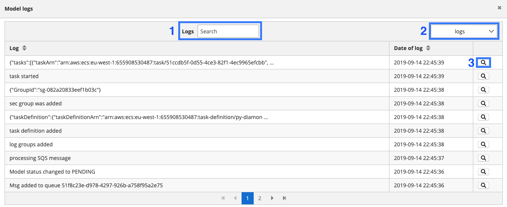
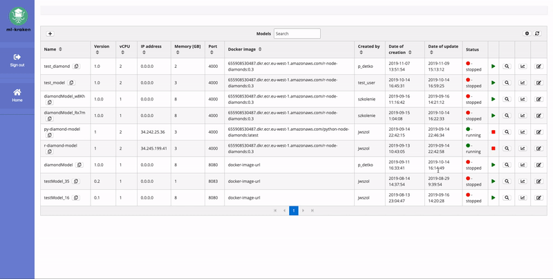
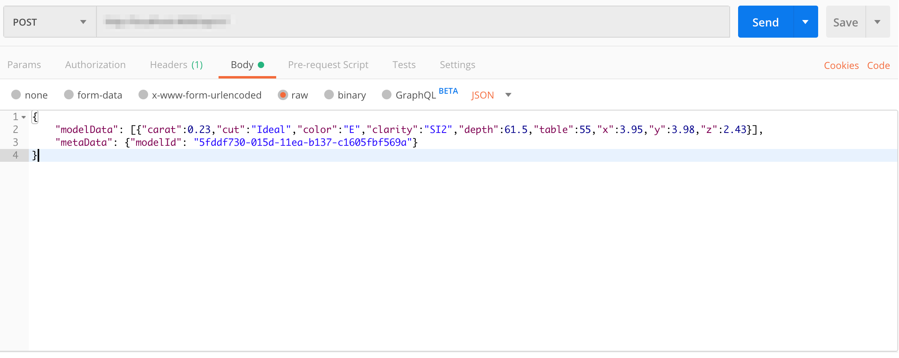
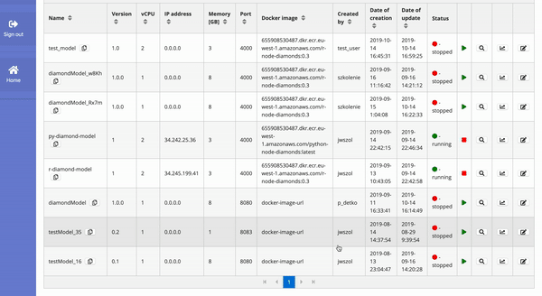

# ml-kraken

ML-Kraken is a fully cloud-based solution designed and built to improve models management process. Each math model is treated as a separate network service that can be exposed under IP address and defined port. This approach is called MaaS (model as a service).

ML-kraken combines two pieces, backend based on serverless solution and frontend which is an Angular based app. As a native execution platform, we decided to use AWS public cloud. 

<p align="center">
  
</p>


## Main features

* R/Spark/Python models deployment
* MaaS (model as a service) - networked models
* models exposed under REST services
* easy integration with real-time analytical systems
* environment that easly scale-up
* ability to keep many model versions in one place
* jupyterhub plugin to communicate with ML-Kraken  

## Demo

<p align="center">
  
</p>


## Requirements

* AWS account created
* serverless installed
* npm installed


## Cloud install

Before running build-and-deploy.sh script setup access to your AWS account. The serverless framework looks for .aws folder on your machine.

```
git clone git@github.com:datamass-io/ml-kraken.git
cd ./ml-kraken
./build-deploy.sh
```

## UI elements

### Models table

This is the main part of ML Kraken where all created models are stored. It allows to:
<ul>
  <li>add/star/stop models</li>
  <li>view the response time of individual calculations in the model</li>
  <li>view logs for each model</li>
</ul>

<p align="center">
  
</p>

Functions of selected table fragments:

<ol>
  <li>The button opens the form for adding a new model</li>
  <li>Clicking this button allows you to copy the model id. Useful for quickly pasting id into the created query</li>
  <li>Allows filtering of models in the table</li>
  <li>Model status - determines whether the container responsible for a given model is running</li>
  <li>Model start/stop button. Allows to start or stop the container associated with the given model</li>
  <li>Button that opens the model log view</li>
  <li>Opens the graph of response time to given calculations in the model</li>
  <li>Opens the form for editing model parameters</li>
  <li>Selects the displayed columns in the main table</li>
  <li>Refreshes the model table</li>
</ol>

### Logs table
This table stores entries about what operations were performed on the backend side. It is also possible to view the request and response history.

<p align="center">
  
</p>

<p align="center">
  
</p>

The fragments marked in the picture are designed to:
<ol>
  <li>Allow filtering of logs in the table</li>
  <li>Change the type of displayed logs from/to backend logs to/from request and response logs</li>
  <li>Display log details</li>
</ol>

## Running a simple R model

Each ML-Kraken model created has an assigned docker container from Amazon ECS. As a result, it is possible to run independent models that can be addressed with REST queries. After clicking the model start button, it takes a while for the container to become operational and establish an external IP. 

<p align="center">
  
</p>

Performing calculations on a running model requires sending a POST request with the body containing data in JSON format. Example POST request using Postman:

<p align="center">
  
</p>

As above, JSON should contain:
<ul>
  <li>modelData - parameters which are send to model as a input</li>
  <li>metaData - requires specifying the model id to send a request to the correct model</li>
</ul>

After the calculations are finished, a new point will be visible on the graph showing the time from sending the request to the response.

<p align="center">
  
</p>

## Contributing
